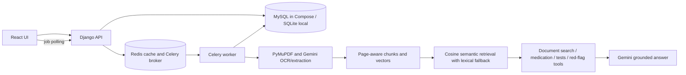

# CareBridge-AI

**Turn discharge summary PDFs into clear, patient-friendly guidance in English, Malayalam, Tamil, and Hindi.**


> **Important:** CareBridge-AI is a demonstration and evaluation project. It is **not** a medical device, has had **no clinical validation**, and has **no authentication or privacy review**. Use synthetic or public documents only. Never upload real patient records.

---

## Table of Contents

- [Overview](#overview)
- [Features](#features)
- [Architecture](#architecture)
- [Quick Start](#quick-start)
- [API Reference](#api-reference)
- [Configuration](#configuration)
- [Evaluation](#evaluation)
- [Load Testing](#load-testing)
- [Service Targets](#service-targets)
- [Data Sources and Licenses](#data-sources-and-licenses)
- [Safety and Limitations](#safety-and-limitations)
- [Testing and Checks](#testing-and-checks)

---

## Overview

CareBridge-AI converts selectable-text or scanned discharge summary PDFs into structured, easy-to-read output:

- Patient-friendly overview
- Medication schedule
- Follow-up plan
- Tests
- Discharge instructions

It also answers questions about the uploaded document, with citations restricted to retrieved pages, and translates extracted details into **English, Malayalam, Tamil, and Hindi**.

**How processing works:** PyMuPDF extracts selectable text. Gemini handles scanned PDFs (OCR), structures the summary, answers document questions, and translates the extracted details.

## Features

- **Hybrid PDF ingestion:** PyMuPDF for text PDFs, Gemini OCR/extraction for scans.
- **Grounded Q&A (RAG):** Page-aware chunking, cosine semantic retrieval, and Unicode lexical fallback. Citations are limited to retrieved pages.
- **Agent with safety tools:** Document search, medication lookup, test lookup, and red-flag detection. A risk gate runs before retrieval and any model call, and the normal plan uses at most three tool steps.
- **Schema-validated AI output:** Pydantic validates both extraction and answer JSON.
- **Asynchronous jobs:** Celery and Redis queue uploads, questions, and translations. Job status and errors are persisted, and the browser polls for results.
- **Cost and latency controls:** Redis caches normalized query embeddings, and prompt and output token budgets are configurable.
- **Multilingual output:** English, Malayalam, Tamil, and Hindi.

## Architecture



### Agent behavior

The agent searches uploaded pages, reads structured medication and follow-up records, and flags high-risk wording for human review.

- PDF and question text are treated as **untrusted instructions**.
- Generated JSON is validated with Pydantic, and answers cite retrieved pages.
- Responses include `toolIterations` and `agentDurationMs`.
- Tools are document-grounded safety tools, **not** external clinical databases. The system does not diagnose or recommend dosing.
- Redis caches normalized query embeddings by model and question for `QUERY_EMBEDDING_CACHE_TTL_SECONDS` (default: one hour), reducing repeat-query latency and usage.
- Prompts are bounded by `GEMINI_MAX_PROMPT_CHARS`. Structured calls cap each response with `GEMINI_MAX_OUTPUT_TOKENS`, and any JSON-format repair is limited to the remaining `GEMINI_MAX_TOTAL_OUTPUT_TOKENS` budget.

### Retrieval details

- Chunks split at paragraph boundaries, then at 700 characters, preserving page IDs. This keeps citations focused and chunks below the embedding model's 2,048-token input limit in typical text. Unusually token-dense material may fall back to lexical retrieval.
- Embeddings use the stable `gemini-embedding-001` model with retrieval document/query task types. Vectors are 256-dimensional, normalized locally, and stored in MySQL JSON fields. See [Google's embedding docs](https://ai.google.dev/gemini-api/docs/embeddings).
- Retrieval falls back to Unicode lexical matching when embeddings are unavailable or a document exceeds 256 chunks.

## Quick Start

### Prerequisites

- Python 3 and `pip`
- Node.js and `npm`
- Docker (for Redis or the full Compose stack)
- A Gemini API key

### Option A: Local development

1. **Configure the environment.** Copy `backend/.env.example` to `backend/.env` and set `GEMINI_API_KEY`. Never commit the key or expose it to the frontend.

2. **Install backend dependencies and migrate:**

   ```bash
   python -m pip install -r backend/requirements.txt
   python backend/manage.py migrate
   ```

3. **Start Redis** (published only on `127.0.0.1:6379`), or run a native Redis server:

   ```bash
   docker compose up -d redis
   ```

4. **Start the Celery worker.** In a backend terminal with the project venv active, and keep it open:

   ```bash
   cd backend
   celery -A config worker --loglevel=INFO --pool=solo   # --pool=solo is for Windows
   ```

5. **Start the Django server** in another backend terminal:

   ```bash
   cd backend
   python manage.py runserver
   ```

6. **Start the frontend:**

   ```bash
   cd frontend
   npm install
   npm run dev
   ```

   Open <http://localhost:5173>.

The frontend calls `/api` through Vite. If no Celery worker is running, queued actions report that clearly. `/api/upload/` and `/api/agent/query/` remain synchronous compatibility routes.

### Option B: Docker Compose

Build the frontend once on the host, then start the stack from the repository root:

```powershell
cd frontend; npm ci; npm run build; cd ..
docker compose up --build
```

Compose starts **MySQL 8.4, Redis, Django/Gunicorn, Celery, and Nginx**. Open <http://localhost:8080>. Named volumes persist DB and Redis data.

- Copy `backend/.env.example` to `backend/.env` for the Gemini key.
- Optionally copy the root `.env.example` to `.env` and replace the DB and Django secrets. Compose credentials and the Django key are **demo defaults**; replace them for any shared deployment.
- Do not run a second local Django server on port 8000 while the Compose backend is running.
- Tune `CELERY_CONCURRENCY`, `GUNICORN_WORKERS`, `GUNICORN_THREADS`, and `AI_RATE_LIMIT_PER_MINUTE` only after measuring.

### Public single-host deployment

For automatic HTTPS on a single host, see [`evaluation/README.md`](evaluation/README.md) and [`docker-compose.production.yml`](docker-compose.production.yml). This requires a VM, public DNS, production secrets, and inbound ports 80/443. It does not create a cloud URL or prove zero-downtime rollout.

## API Reference

| Method | Endpoint | Purpose |
| --- | --- | --- |
| GET | `/api/health/` | Django/Redis health and Gemini configuration |
| POST | `/api/upload-jobs/` | Queue PDF processing |
| POST | `/api/agent/jobs/` | Queue a validated document question |
| POST | `/api/translation-jobs/` | Queue extracted-summary translation |
| GET | `/api/agent/jobs/{jobId}/` | Poll queued/running/succeeded/failed job |
| POST | `/api/upload/` | Synchronous PDF processing |
| POST | `/api/agent/query/` | Synchronous document question |
| POST | `/api/discharge-summaries/{id}/translate/` | Translate extracted details |
| GET | `/api/agent/usage/` | Aggregate token totals and configured cost estimate |

Full specification: [`backend/api/openapi.yaml`](backend/api/openapi.yaml).

## Configuration

Key environment variables (set in `backend/.env`):

| Variable | Purpose |
| --- | --- |
| `GEMINI_API_KEY` | Gemini credentials (backend only) |
| `GEMINI_MAX_PROMPT_CHARS` | Upper bound on prompt size |
| `GEMINI_MAX_OUTPUT_TOKENS` | Per-response output cap for structured calls |
| `GEMINI_MAX_TOTAL_OUTPUT_TOKENS` | Total budget, including JSON-format repair |
| `QUERY_EMBEDDING_CACHE_TTL_SECONDS` | Query-embedding cache lifetime (default 3600) |
| `AI_RATE_LIMIT_PER_MINUTE` | AI endpoint rate limit |
| `CELERY_CONCURRENCY`, `GUNICORN_WORKERS`, `GUNICORN_THREADS` | Throughput tuning |

## Evaluation

> Gemini-backed evaluations use API quota and may incur cost. Synthetic scores are **not** clinical validation.

| Check | Command | Uses Gemini? |
| --- | --- | --- |
| 20-question synthetic retrieval | `python backend/api/eval_harness.py --output evaluation/retrieval-report.json` | No |
| 50-PDF text processing, session continuity, five failure cases | `python backend/manage.py test api` | No |
| Answer quality, prompts v1/v2/v3 | `python backend/api/eval_harness.py --answers --all-prompts --output evaluation/answer-quality.json` | Yes (60 generations plus embeddings, retries, repairs) |

The chunk benchmark also supports JSON output via `--output`. Optional Ragas scoring is documented in [`evaluation/README.md`](evaluation/README.md) and [`REQUIREMENTS.md`](REQUIREMENTS.md). The current 50-PDF result is in [`evaluation/50-pdf-report.json`](evaluation/50-pdf-report.json).

### Retrieval snapshot

One 20-question synthetic retrieval run using the Unicode lexical fallback achieved **100% hit rate, 100% recall, and 80% precision**. These figures measure evidence/page retrieval on this fixture only, not answer correctness or clinical accuracy. Latency is a local run snapshot, not a guarantee.


### Cost per query

Cost per query is **not measured** in the current artifacts. Answer-quality runs record token usage, but `mean_cost_usd_per_question` is unpriced because provider rates were not configured or verified. To measure it, set current Gemini input/output token rates in `backend/.env`, rerun the answer-quality evaluation, and report the model, pricing date, token assumptions, and resulting USD/query.

## Load Testing

Load tests use [Locust](https://locust.io/) from the project root. The profile mixes concurrent health/usage API requests with a direct Redis SET/GET round trip, reported as its own operation (`REDIS / Redis SET/GET`) alongside HTTP endpoint latencies. `GET /api/health/` also exercises Redis through Django.

```powershell
docker compose --profile loadtest up --build
```

Open <http://localhost:8089>, set users, ramp-up, and duration, and record actual results in [`loadtest/REPORT_TEMPLATE.md`](loadtest/REPORT_TEMPLATE.md).

**Headless 20-user, 5-minute profile:**

```powershell
docker compose --profile loadtest run --rm locust -f /loadtest/locustfile.py --headless --host http://backend:8000 --users 20 --spawn-rate 4 --run-time 5m --csv /results/20-users
```

For a 3-user concurrency check, use `--users 3 --spawn-rate 3 --run-time 1m`. These are concurrent virtual users making mixed requests, not a synchronized burst.

### Latest snapshot

One completed Locust run on the health and usage endpoints recorded 30 requests, 0 failures, 2.33 requests/second, and 250 ms aggregated p95 latency. These results are from this run only.


### AI-workload profiles

Set `LOAD_TEST_SUMMARY_ID` (chat jobs) or `LOAD_TEST_PDF` (upload jobs; mount the synthetic PDF under `loadtest/data`). These invoke Gemini and may consume quota or incur cost. Without them, Locust measures health/usage traffic only. **Do not fill in estimated values as measured results.**

For a concurrent query profile, use [`loadtest/run-query-profile.ps1`](loadtest/run-query-profile.ps1) with a processed synthetic document ID. It measures async submission and job polling separately and writes a metadata sidecar. [`loadtest/compare-locust-profiles.py`](loadtest/compare-locust-profiles.py) checks matched before/after CSVs against the syllabus's 30% p95-improvement target.

### Reports

| Report | Description |
| --- | --- |
| [`loadtest/20-users-report.md`](loadtest/20-users-report.md) | Historical 20-user health/usage baseline |
| [`loadtest/concurrent-redis-report.md`](loadtest/concurrent-redis-report.md) | Latest 3-user health/usage plus direct Redis run |
| [`loadtest/live-query-profile-report.md`](loadtest/live-query-profile-report.md) | 3-user and 10-user synthetic document-query measurements (enqueue, end-to-end, Redis latency, failures) |
| [`loadtest/concurrent-redis-graph.html`](loadtest/concurrent-redis-graph.html) | Recent 3-user p95 latency and failure graph |

The historical 20-user and syllabus-profile CSVs predate direct Redis instrumentation; use the concurrent Redis report for measured Redis results.

Generate a self-contained p95 latency and failure graph from any Locust run:

```bash
python loadtest/render-locust-report.py loadtest/results/<prefix>_stats.csv loadtest/results/<prefix>_stats_history.csv --output loadtest/<prefix>-graph.html
```

## Service Targets

CareBridge-AI provides **no production availability SLA or uptime guarantee**. All figures below are experimental results from documented local test environments, not guarantees.

| Measurement | Result | Scope |
| --- | --- | --- |
| 20-user lightweight API baseline | p50 9 ms, p95 14 ms, 0.10% failures | Excludes Gemini, PDF processing, chat, and translation |
| Live document-query profile, 3 users | Full-query p95 3.5 s, 0 failures | Local Docker, synthetic data, short duration, one query per user |
| Live document-query profile, 10 users | Full-query p95 6.1 s, 0 failures | Same as above |

See the linked reports for complete test conditions and limitations.

## Data Sources and Licenses

- The demo PDF, evaluation discharge summary, and CSV records are **synthetic**, authored for this repository. They contain no real patient data and carry no third-party data license dependency.
- The runtime corpus is the PDF supplied by the user. Use synthetic or explicitly public documents only.
- No external treatment guideline, prescribing recommendation, or drug-interaction dataset is bundled. Medication lookups come from the uploaded document, persisted as structured MySQL rows. The agent does not use model memory to invent drug facts.
- Regenerate and validate synthetic data from the repository root:

  ```bash
  python generate_discharge_data.py
  python validate_discharge_data.py
  ```

## Safety and Limitations

- **Not for clinical use.** The system does not diagnose or recommend dosing. OCR, extraction, translation, and answers can be wrong. Verify medicine names, doses, dates, alerts, and tests against the original PDF, and consult a clinician about care decisions.
- **Third-party processing.** Gemini is an external service. Review its current data terms before sending any sensitive information.
- **No authentication or retention policy.** The demo has no auth, no data-retention policy, and no production privacy review.
- **Synthetic evaluation.** Fixtures are synthetic; scores do not reflect real-world clinical performance.
- **Performance coverage.** Existing load-test reports for health/usage do not measure document-query latency, and a live cloud URL still requires deployment configuration and runs.

## Testing and Checks

```powershell
python backend/manage.py check
python backend/manage.py test api
python backend/api/eval_harness.py
```
