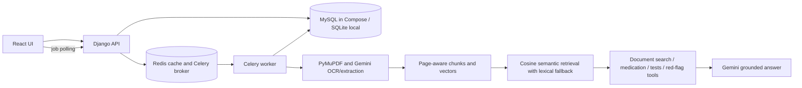
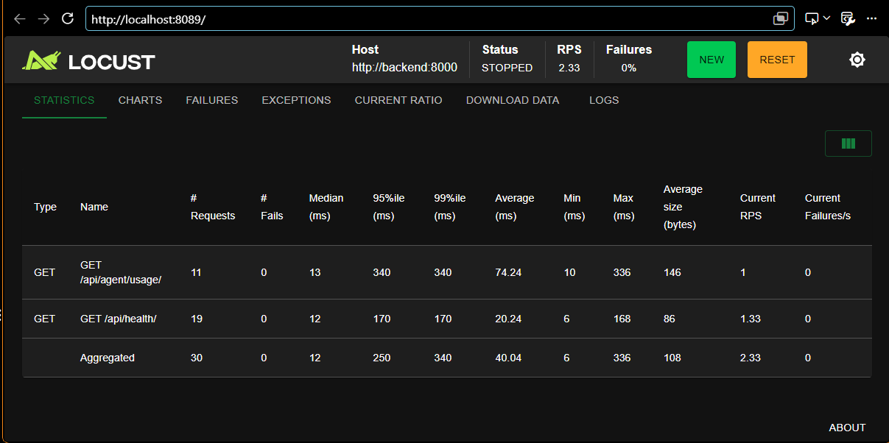

# CareBridge-AI

CareBridge-AI turns selectable-text or scanned discharge summary PDFs into a patient-friendly overview, medication schedule, follow-up plan, tests, and discharge instructions. It supports English, Malayalam, Tamil, and Hindi. PyMuPDF extracts selectable text; Gemini processes scanned PDFs, structures the summary, answers document questions, and translates the extracted details.

## Local development

1. Copy `backend/.env.example` to `backend/.env` and set `GEMINI_API_KEY`; never commit the key or put it in the frontend.
2. Install dependencies: `python -m pip install -r backend/requirements.txt`.
3. Run `python backend/manage.py migrate`, then `python backend/manage.py runserver`.
4. Start a local Redis broker with `docker compose up -d redis` (Redis is published only on `127.0.0.1:6379`), or run a native Redis server.
5. In a backend terminal with the project venv active, run `cd backend` then `celery -A config worker --loglevel=INFO --pool=solo` on Windows. Keep that terminal open. In another backend terminal, run `python manage.py runserver`.
6. In another terminal run `cd frontend`, `npm install`, `npm run dev` and open `http://localhost:5173`.

Alternatively, run the entire stack with `docker compose up --build -d` and open `http://localhost:8080`. Do not run a second local Django server on port 8000 at the same time as the Compose backend.

The frontend calls `/api` through Vite. If no Celery worker is running, queued actions report that clearly. `/api/upload/` and `/api/agent/query/` remain synchronous compatibility routes.

## API

| Method | Endpoint | Purpose |
| --- | --- | --- |
| GET | `/api/health/` | Django/Redis health and Gemini configuration |
| POST | `/api/upload-jobs/` | Queue PDF processing |
| POST | `/api/agent/jobs/` | Queue a validated document question |
| POST | `/api/translation-jobs/` | Queue extracted-summary translation |
| GET | `/api/agent/jobs/{jobId}/` | Poll queued/running/succeeded/failed job |
| POST | `/api/upload/` | Synchronous PDF processing |
| POST | `/api/agent/query/` | Synchronous document question |
| POST | `/api/discharge-summaries/{id}/translate/` | Translate extracted details |
| GET | `/api/agent/usage/` | Aggregate token totals and configured cost estimate |

OpenAPI: [`backend/api/openapi.yaml`](backend/api/openapi.yaml). Pydantic validates AI answer and extraction schemas. RAG citations are restricted to retrieved pages. AI jobs persist their status and errors; the browser polls asynchronously.

## Architecture



The agent searches uploaded pages, reads structured medication and follow-up records, and flags high-risk wording for human review. Its normal plan has at most three tool steps; the risk gate runs before retrieval and any model call. Redis caches normalized query embeddings by model and question for `QUERY_EMBEDDING_CACHE_TTL_SECONDS` (one hour by default), reducing repeat-query embedding latency and usage. These are document-grounded safety tools, not external clinical databases. The system does not diagnose or recommend dosing. The agent treats PDF/question text as untrusted instructions, validates generated JSON with Pydantic, cites retrieved pages, and returns `toolIterations` plus `agentDurationMs`. Gemini prompts are bounded by `GEMINI_MAX_PROMPT_CHARS`; structured calls cap each response with `GEMINI_MAX_OUTPUT_TOKENS` and any one JSON-format repair with the remaining `GEMINI_MAX_TOTAL_OUTPUT_TOKENS` budget.

## Evaluation and performance

`python backend/api/eval_harness.py --output evaluation/retrieval-report.json` runs the 20-question synthetic retrieval check without Gemini. The chunk benchmark supports JSON output with `--output`. To generate v1/v2/v3 answer samples, run `python backend/api/eval_harness.py --answers --all-prompts --output evaluation/answer-quality.json`; this makes 60 answer generations plus embeddings, retries, and repairs. Optional Ragas scoring is documented in [`evaluation/README.md`](evaluation/README.md) and [`REQUIREMENTS.md`](REQUIREMENTS.md). These calls use Gemini quota and may incur cost. The 50-PDF synthetic text-processing run, session-continuity check, and five failure cases run through `python backend/manage.py test api` without Gemini calls; the current 50-PDF result is [here](evaluation/50-pdf-report.json). These synthetic scores are not clinical validation.

Use Locust from the project root. The profile mixes concurrent health/usage API requests with a direct Redis SET/GET round trip. `GET /api/health/` also exercises Redis through Django. Locust reports Redis as its own operation alongside HTTP endpoint latencies:

The screenshot below shows one completed Locust snapshot for the health and usage endpoints: 30 requests, 0 failures, 2.33 requests per second, and 250 ms aggregated p95 latency. These are results from this run only, not an SLA or a general performance guarantee.



```powershell
docker compose --profile loadtest up --build
```

Open `http://localhost:8089`, set users/ramp-up/duration, and record actual results in [`loadtest/REPORT_TEMPLATE.md`](loadtest/REPORT_TEMPLATE.md). Historical baselines are documented in [`loadtest/20-users-report.md`](loadtest/20-users-report.md); the latest three-user Redis/API run is in [`loadtest/concurrent-redis-report.md`](loadtest/concurrent-redis-report.md). To run the syllabus 20-user, 5-minute profile headlessly:

```powershell
docker compose --profile loadtest run --rm locust -f /loadtest/locustfile.py --headless --host http://backend:8000 --users 20 --spawn-rate 4 --run-time 5m --csv /results/20-users
```

That profile also measures direct Redis operations (`REDIS / Redis SET/GET`) and keeps those results separate from HTTP. Use `--users 3 --spawn-rate 3 --run-time 1m` for a 3-user concurrency check. These are concurrent virtual users making mixed requests, not a synchronized burst of simultaneous requests. The historical 20-user and syllabus-profile CSVs predate direct Redis instrumentation; use the newer [concurrent Redis report](loadtest/concurrent-redis-report.md) for measured Redis results.

Generate a self-contained p95 latency and failure graph from any Locust run with `python loadtest/render-locust-report.py loadtest/results/<prefix>_stats.csv loadtest/results/<prefix>_stats_history.csv --output loadtest/<prefix>-graph.html`. The recent three-user graph is [`loadtest/concurrent-redis-graph.html`](loadtest/concurrent-redis-graph.html).

Set `LOAD_TEST_SUMMARY_ID` for chat jobs or `LOAD_TEST_PDF` for upload jobs (mount the synthetic PDF under `loadtest/data`). These invoke Gemini and may consume quota or cost. Without those options Locust measures health/usage traffic. Do not fill in estimated performance values as measured results.

For an actual concurrent query profile, use [`loadtest/run-query-profile.ps1`](loadtest/run-query-profile.ps1) with a processed synthetic document ID. It measures the async query submission and job polling separately and writes a profile metadata sidecar. The script warns that Gemini quota may be used. [`loadtest/compare-locust-profiles.py`](loadtest/compare-locust-profiles.py) checks matched before/after CSVs and metadata against the syllabus's 30% p95-improvement target.
- [`loadtest/live-query-profile-report.md`](loadtest/live-query-profile-report.md) contains the latest
  3-user and 10-user synthetic document-query measurements, including enqueue,
  end-to-end query latency, Redis latency, and request failures.
## SLA / service targets

CareBridge-AI is currently a demonstration and evaluation project. It does not
provide a production availability SLA or uptime guarantee.

The latency and failure-rate measurements in the evaluation and load-test
reports are experimental results for the documented local test environments.
They are not production SLAs or guarantees.

Current measured references include:

- 20-user lightweight API baseline: p50 9 ms, p95 14 ms, 0.10% request
  failure rate. This test did not include Gemini, PDF processing, chat, or
  translation.
- Live synthetic document-query profile: 3-user full-query p95 3.5 s and
  10-user full-query p95 6.1 s, with 0 request failures in both runs.
- The live-query results are limited to the tested local Docker environment,
  synthetic data, short test duration, and one document query per user.

These values are reported as measured test results, not service-level
guarantees. See the linked evaluation and load-test reports for the complete
test conditions and limitations.
## Run with Docker

Build the frontend once on the host (`cd frontend; npm ci; npm run build`), then from the repository root:

```powershell
docker compose up --build
```

Compose starts MySQL 8.4, Redis, Django/Gunicorn, Celery, and Nginx. Open `http://localhost:8080`. Named volumes persist DB and Redis data. Copy `backend/.env.example` to `backend/.env` for the Gemini key; optionally copy root `.env.example` to `.env` and replace the DB and Django secrets. Compose's database credentials and Django key are demo defaults; replace them for any shared deployment. Tune `CELERY_CONCURRENCY`, `GUNICORN_WORKERS`, `GUNICORN_THREADS`, and `AI_RATE_LIMIT_PER_MINUTE` only after measuring.

For a public single-host deployment with automatic HTTPS, see [`evaluation/README.md`](evaluation/README.md) and [`docker-compose.production.yml`](docker-compose.production.yml). It requires a VM, public DNS, production secrets, and inbound ports 80/443; it does not itself create a cloud URL or prove zero-downtime rollout.

## Data sources and licenses

- The demo PDF, evaluation discharge summary, and CSV records are synthetic examples authored for this repository. They contain no real patient records and have no third-party source or data license dependency.
- The runtime document corpus is the PDF deliberately supplied by the user. The demo should use synthetic or explicitly public documents; do not upload real patient records to this unauthenticated demo.
- No external treatment guideline, prescribing recommendation, or drug-interaction dataset is bundled. Medication lookups are extracted from the uploaded document and persisted as structured MySQL rows; the agent does not use model memory to invent drug facts.
- Generated synthetic data can be reproduced with `python generate_discharge_data.py` and checked with `python validate_discharge_data.py` from the repository root.

## Data, limitations, and safety

- The evaluation fixture is synthetic and authored for this project. Runtime PDFs are supplied by the user; no external clinical guideline or drug reference data is bundled.
- Retrieval splits at paragraph boundaries, then at 700 characters while preserving page IDs. The bound keeps chunks compact for focused citations and below the embedding model's 2,048-token input limit in typical text; unusually token-dense material may still fall back to lexical retrieval. Normalized, page-aware Gemini text vectors are stored in MySQL JSON fields and ranked by cosine similarity. It falls back to Unicode lexical retrieval when embeddings are unavailable or a document has more than 256 chunks. The embedding endpoint uses the stable `gemini-embedding-001` model and retrieval document/query task types; vectors are 256 dimensions and normalized locally. See [Google's embedding docs](https://ai.google.dev/gemini-api/docs/embeddings).
- Gemini is a third-party service. Review its current data terms before sending sensitive information. This demo has no authentication, retention policy, clinical validation, or production privacy review; use synthetic/public documents only.
- OCR, extraction, translation, and answers can be wrong. Check medicine names, doses, dates, alerts, and tests against the original PDF and ask a clinician about care decisions.
- Local Docker Compose load-test reports are in [`loadtest/20-users-report.md`](loadtest/20-users-report.md) (historical 20-user health/usage profile) and [`loadtest/concurrent-redis-report.md`](loadtest/concurrent-redis-report.md) (three-user health/usage plus direct Redis). Neither measures document-query latency. An AI-workload benchmark and live cloud URL still require Gemini/deployment configuration and runs.

### Cost per query

Cost per query is **not measured** in the current evaluation artifacts.
The answer-quality runs record token usage, but `mean_cost_usd_per_question`
is currently unpriced because provider rates were not configured/verified
for the evaluation run. No estimated cost is presented as a measured result.

To measure it in a future run, configure the current Gemini input/output
token rates in `backend/.env`, run the answer-quality evaluation again, and
report the model, pricing date, token assumptions, and resulting USD/query.
## Checks

```powershell
python backend/manage.py check
python backend/manage.py test api
python backend/api/eval_harness.py
```
